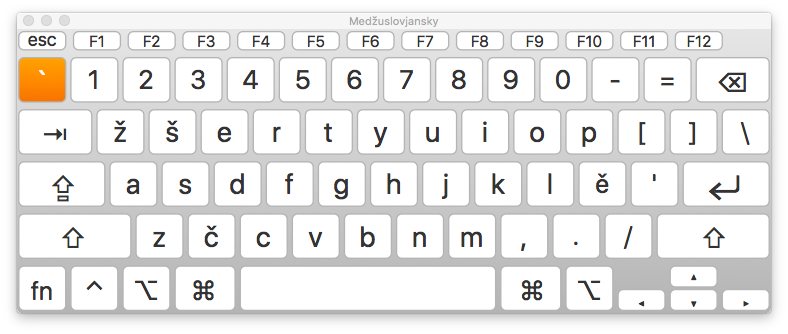

<!-- PROJECT LOGO -->
<br />
<div align="center">
  <a href="https://github.com/github_username/repo_name">
    
  </a>

<h3 align="center">Medžuslovjanske klaviatury/tipkovnici za Mac OS</h3>
<h3 align="center">Меджусловјанске клавиатуры/типковници за Mac OS</h3>

</div>


<!-- ABOUT THE PROJECT -->
## Informacija | Информација

Tutčas dostupne tipkovnici i layouty: latinična tipkovnica (za standardny i etimologičny pravopis), kiriličska tipkovnica s vozhodnym layoutom (shodny s russkym, bělorusskym i ukrajinskym), kiriličska tipkovnica s bulgarskym fonetičnym layoutom. Zaplanovanoju je takože kiriličska tipkovnica s srbskym/makedonskym layoutom. 

Тутчас доступне клавиатуры и лејауты: латинична клавиатура (за стандардны и етимологичны правопис), кириличска клавиатура с возходным лејаутом (сходны с русскым, бєлорусскым и украјинскым), кириличска клавиатура с булгарскым фонетичным лејаутом. Запланованоју је такоже кириличска клавиатура с србскым/македонскым лејаутом. 

<!-- GETTING STARTED -->
## Kako koristati | Како користати

### Daunlodovanje | Даунлодованје

Na pravoj (desnoj) straně tutoj stranici izbrati punkt "Mac Klaviatury/Tipkovnici" v menju "Releases" ("Relizy"). Za tym natisknuti na .zip fajl s tipkovnicami na stranici, ktora odkryje se.

На правој (десној) странє тутој страници избрати пункт "Mac Klaviatury/Tipkovnici" в мењу "Releases" ("Релизы"). За тым натискнути на .zip фајл с типковницами на страници, ктора одкрыје се.

### Instalacija | Инсталација

1. Razpakovati daunlodovany .zip fajl. | Разпаковати даунлодованы .zip фајл.
2. Položiti dostany .bundle fajl v direktoriju: | Положити достаны .bundle фајл в директорију: 
   ```
   ~/Library/Keyboard Layouts
   ```
3. Restartovati kompjuter ili relogovati se. | Рестартовати компјутер или релоговати се.
4. Dodaty ustanovjene tipkovnici kako žrla inputa: | Додати установјене клавиатуры како жрла инпута:
   ```
   Sistemne nastavjenja > Tipkovnici > Žrla inputa > +
   Системне настројкы > Клавиатуры > Жрла инпута > +
   ```


<!-- USAGE EXAMPLES -->
## Obrazy tipkovnic | Образы типковниц

wip


<!-- CONTACT -->
## Kontakt i feedback | Контакт и фидбек

Your Name - [@twitter_handle](https://twitter.com/twitter_handle) - email@email_client.com

Project Link: [https://github.com/github_username/repo_name](https://github.com/github_username/repo_name)


<!-- ACKNOWLEDGMENTS -->
## Acknowledgments

* []()
* []()
* []()
